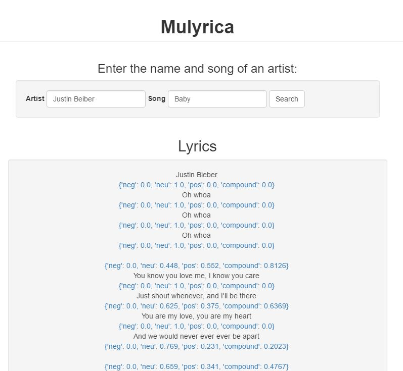

# Mulyrica

Analyzing song lyrics using nlp packages/resources.

## Contents
1. Flask version of the app (flask)
2. Express version of the app (xpress)
3. Android app (android)

## Xpress
This folder contains a barebones nodejs application generated by the express-generator
The app uses handlebars.js as a viewing engine

## Android app
This folder contains all contents related to the android app.

## Flask app
This folder contains all files related to the website as built by flask

### Setup
1. **Express app**
Assuming you have express and express-generator already 
installed on your machine, cd into xpress and run `npm install`
See `express -h` for help information

2. **Android app**
- Comming soon

3. **Flask app**
- Comming soon

### Running
1.**Express app**
DEBUG=xpress:* npm start*

2.**Android app**
- Comming soon

3.**Flask app**
- Comming soon

## Installing plugins & deploying

## Maintenance

