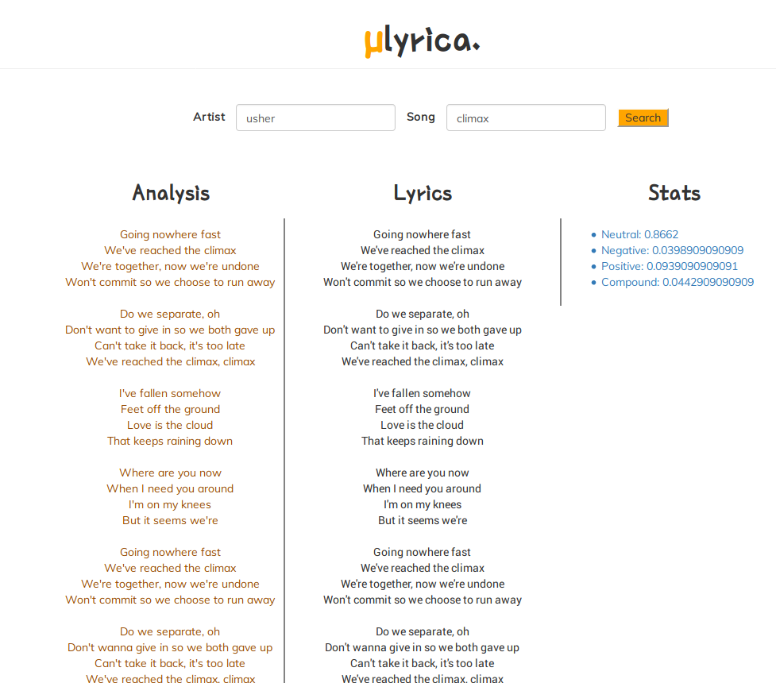

# Mulyrica
A tool for creating, analyzing and providing useful insights into lyrics. 

```
Inputs: Song and Author + Tweets
Outputs: Sentiment Analysis + Lyrics
```

## Preliminaries
There are two branches of this repository
 1. Currently the master branch resides in a bitbucket repo **(Mulyrica)**
 2. A branch **(ubranch)** resides in both the bitbucket repo and the github repo **(lbapp)**
 3. Currently investigating an issue with the spacy plugin via **ubranch**

You might have to install the `vader_lexicon` package (Will fix this) to use the
`SentimentIntensityAnalyzer`.

Run this in `python shell` after activating venv` `nltk.download('vader_lexicon').`

## Activating virtualenvironment
- ~~**Linux** users go to `webapp/venv/bin/` and run `source activate`.~~
- create a pyenv 1 dir above app
- `source ../pyenv/bin/activate`
- ~~Also edit `run.py` to ensure that the path to python is `venv/bin/python/`~~
- Edit `werk.py` to run the python in `pyenv`
- ~~**Windows** users go to `mulyrica/Scripts/` and run `activate.`
Also edit `run.py` accordingly as shown above.~~

Make sure to install `gunicorn` and `werkzeug` server packages.

Windows user will have to modify `werk.py` to point to where their virtualenv is.


### Development environment
Beginning with flask 0.11, run flask from the `cli` when doing development
```
  $ export FLASK_APP=my_application
  $ export FLASK_ENV=development
  $ flask run
```

For production simply do:
```
## Running
- ~~`chmod a+x run.py`~~
- `chmod 700 werk.py`
- ~Then do `./run.py` and navigate to `http://localhost:5000`~
- `./werk.py` to run app on `werkzeug` server.
- `./guni.py` to run on `gunicorn`.
```

## License
- Pending
